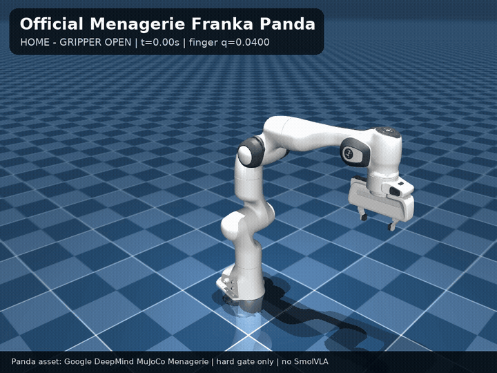
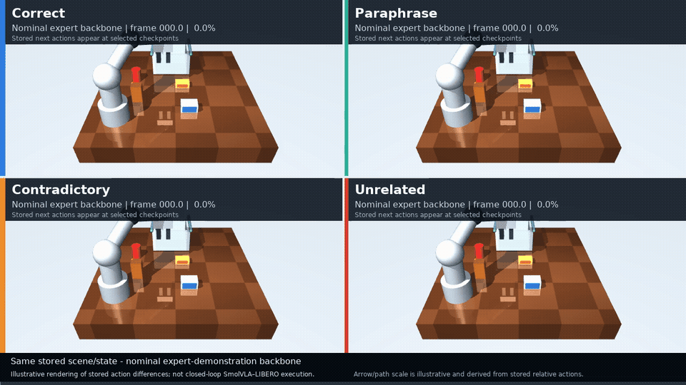
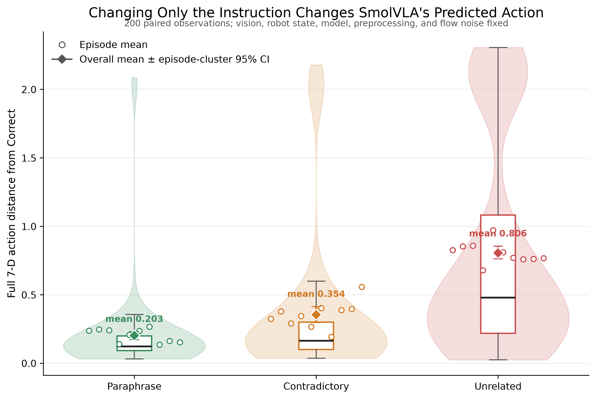
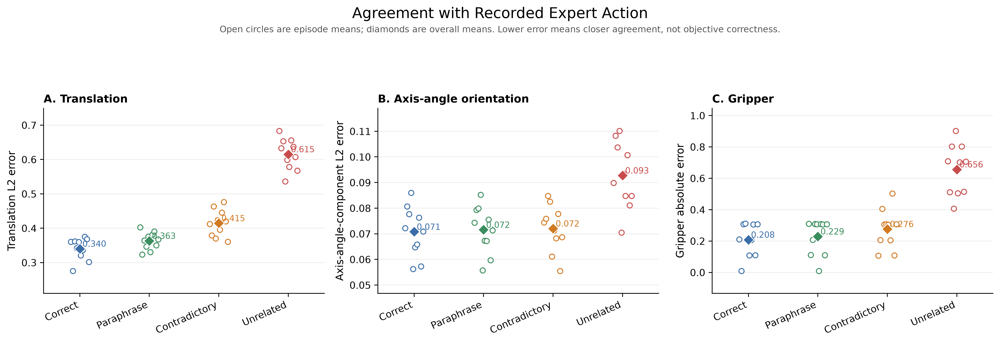
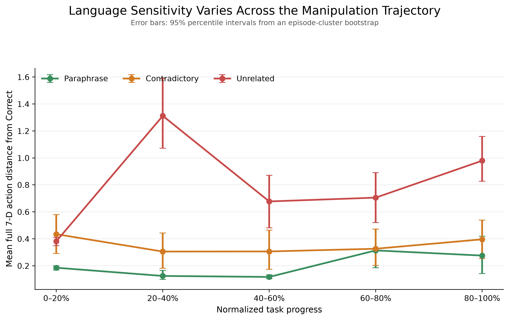
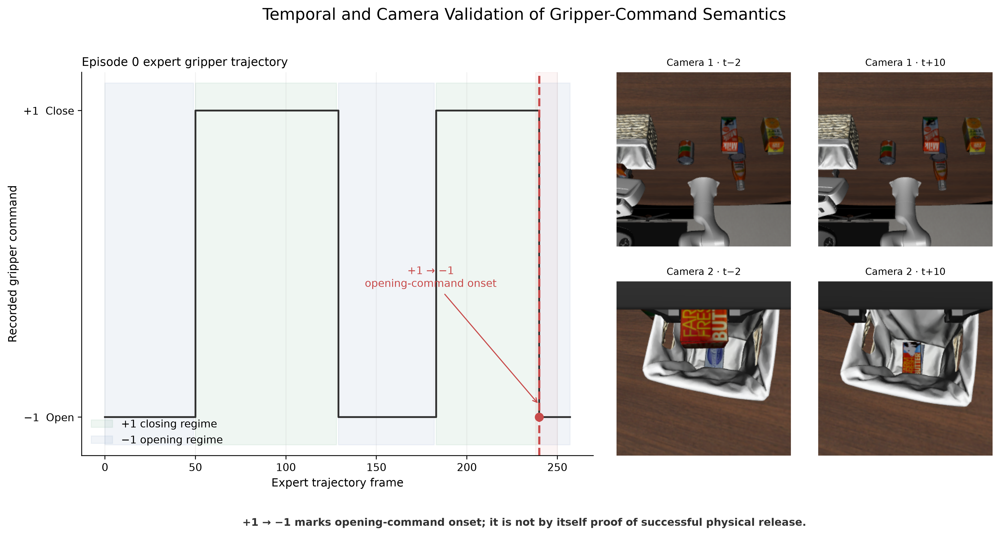

# Controlled Language Sensitivity in SmolVLA

This project evaluates how changing only a natural-language instruction alters the action predicted by a pretrained Vision-Language-Action model. It combines a controlled paired experiment, trajectory-stage analysis, agreement measurements against recorded demonstrations, and an empirical audit of binary gripper-control semantics.

The project evaluates `HuggingFaceVLA/smolvla_libero` on demonstrations from `HuggingFaceVLA/smol-libero`. It does **not** train or fine-tune SmolVLA, and it does not claim closed-loop task success or safety.

## Motivation

A VLA policy receives language, images, and robot state together. If its action changes under semantically equivalent, contradictory, or unrelated instructions, that behavior matters for reliability. The central question is:

> How much does changing only the natural-language instruction alter SmolVLA's predicted action when vision, robot state, preprocessing, model, and flow-matching noise are fixed?

## Experimental design

- Pretrained model: `HuggingFaceVLA/smolvla_libero`
- Dataset: `HuggingFaceVLA/smol-libero`
- Hardware used for stored inference: Apple M2 Max, `mps:0`
- 10 locally available episodes
- 20 stratified observations per episode; 200 observations total
- Four language conditions: Correct, Paraphrase, Contradictory, Unrelated
- 800 stored predictions
- Same two images, robot state, preprocessing, checkpoint, and explicit flow-noise tensor within every four-condition comparison

The explicit flow noise has checkpoint-specific shape `(1, 50, 32)`, dtype `float32`, and is reused exactly across all four language conditions for an observation. `results/main_experiment_selection.json` records the deterministic sample selection, noise seeds, and noise hashes. `results/vla_predictions.csv` is the immutable source of truth for final analysis.

## Visual demo

The GIF below shows the complete stored episode 0 trajectory from the agent and eye-in-hand cameras. It uses existing dataset frames only; no new model inference or simulation was run.


### Official Menagerie Panda hard gate

The official Google DeepMind MuJoCo Menagerie `franka_emika_panda` asset is
vendored unchanged at `sim/assets/mujoco_menagerie/franka_emika_panda/` from
revision `da76818e269b82289eba39808e2fb91d679d6994` under its included Apache-2.0
license. MuJoCo 3.11.0 compiles the model with `nq=9`, `nv=9`, and `nu=8`.
The hard gate moves all seven articulated arm joints and closes and reopens the
actual Panda gripper through the upstream actuators.



Regenerate this asset-only validation with:

```bash
.venv/bin/python sim/mujoco_panda_hard_gate.py
```

Exact joint/actuator names, source hashes, motion ranges, and output metadata
are recorded in `results/mujoco_panda_hard_gate/validation.json`. This is not a
packing rollout and does not load SmolVLA or LIBERO. The custom Panda packing
scene and trajectory-tracking IK begin only after review of this gate.

### Illustrative MuJoCo prompt comparison

The synchronized 2×2 animation uses the complete stored episode-0 expert
end-effector XYZ trajectory as one shared nominal backbone. At eight
deterministic checkpoints it overlays the four stored next-action proposals
from `results/vla_predictions.csv`. Prompt-conditioned predictions are shown as
scaled translation arrows/ghost targets, full 7-D distances from Correct, and
opening/closing gripper regimes; they are never integrated into the nominal
motion.

> Illustrative rendering of stored action differences; not closed-loop SmolVLA–LIBERO execution.



Run the already-validated preview, full render, or storyboard generation:

```bash
.venv/bin/python sim/mujoco_prompt_animation.py --mode preview
.venv/bin/python sim/mujoco_prompt_animation.py --mode render
.venv/bin/python sim/mujoco_prompt_animation.py --mode storyboard
```

These modes read stored predictions and the already-local episode parquet. They
do not load SmolVLA or run inference. See
`results/mujoco_prompt_animation/animation_notes.md` and `validation.json` for
the action mapping, checkpoint policy, source hashes, and limitations.

| Language-induced action difference | Agreement with recorded expert action |
|:---:|:---:|
|  |  |
| Language sensitivity across task progress | Gripper-command semantics |
|  |  |

## Main results

Mean full 7-D action distance from the Correct-language prediction:

| Condition | Mean distance | Episode-cluster bootstrap 95% CI |
|---|---:|---:|
| Paraphrase | 0.202755 | [0.172452, 0.231373] |
| Contradictory | 0.354315 | [0.297352, 0.414462] |
| Unrelated | 0.806369 | [0.761888, 0.855950] |

Mean translation / axis-angle orientation / gripper errors against the recorded expert action:

| Condition | Translation | Orientation | Gripper |
|---|---:|---:|---:|
| Correct | 0.340237 | 0.070786 | 0.208461 |
| Paraphrase | 0.363251 | 0.071559 | 0.228939 |
| Contradictory | 0.414641 | 0.072025 | 0.276336 |
| Unrelated | 0.615211 | 0.092736 | 0.656285 |

Under these controlled observations, paraphrases generally produced smaller changes than contradictory or unrelated instructions. Unrelated instructions produced the largest average changes. The ordering is an aggregate result, not a rule for every individual frame. Language sensitivity also varied non-monotonically across task progress.

The final forensic robustness check excludes the gripper channel and recomputes a 6-D arm-only norm over translation plus the three axis-angle components. Its means remain ordered: Paraphrase 0.149570, Contradictory 0.210309, Unrelated 0.467043. The strict full 7-D ordering holds in 125/200 observations and fails in 75/200, so the conclusion is descriptive and aggregate rather than universal.

The expert gripper channel is an exactly binary persistent command: `+1` closes and `-1` opens. A `+1 -> -1` transition marks opening-command onset, but does not by itself prove successful physical release.

See `results/final_findings.md`, `results/final_validation.json`, and `results/presentation_cheatsheet.md` for the concise final record.

## Quick start: inspect completed results

No model checkpoint or dataset download is needed to read the tracked tables, documents, figures, or curated demo assets.

Create the verified Python 3.11 environment if needed:

```bash
UV_CACHE_DIR=/private/tmp/smolvla-uv-cache uv venv --python 3.11 .venv
UV_CACHE_DIR=/private/tmp/smolvla-uv-cache uv pip install --python .venv/bin/python -r requirements.txt
```

Launch the offline viewer:

```bash
.venv/bin/python demo/demo.py
```

Use the buttons or keys `1`–`4` to switch language conditions for the same observation. Use the example buttons or arrow keys to move through curated observations. List them without opening a window with:

```bash
.venv/bin/python demo/demo.py --list-examples
```

## Cheap and safe to rerun

These commands use stored predictions and perform **zero new SmolVLA inference**.

Regenerate Phase 8–9 metrics from `results/vla_predictions.csv`:

```bash
MPLCONFIGDIR="$PWD/.cache/matplotlib" \
  .venv/bin/python experiments/analyze_language_results.py
```

Validate the final sources, regenerate the four final figures, refresh curated examples and camera assets, and rewrite the final findings/cheat sheet:

```bash
MPLCONFIGDIR="$PWD/.cache/matplotlib" \
  .venv/bin/python experiments/finalize_results.py
```

The finalizer needs the already-local episode parquet files only when refreshing camera assets and the representative gripper figure. It never loads the checkpoint. Existing tracked outputs remain directly inspectable without those local caches.

Run the headless demo smoke test:

```bash
MPLBACKEND=Agg MPLCONFIGDIR="$PWD/.cache/matplotlib" \
  .venv/bin/python demo/demo.py --smoke-test
```

Run the independent model-free forensic checks:

```bash
.venv/bin/python experiments/final_independent_validation.py

MPLBACKEND=Agg MPLCONFIGDIR="$PWD/.cache/matplotlib" \
  .venv/bin/python experiments/final_viewer_audit.py
```

## Expensive inference: already completed

The two-stage command below produced the 800 predictions. **Do not run it merely to inspect, analyze, plot, or demonstrate the completed project.** The driver is resumable and validates every existing row, but running it requires the local checkpoint/dataset and MPS access.

```bash
PYTORCH_ENABLE_MPS_FALLBACK=0 HF_HOME="$PWD/.cache/huggingface" \
  .venv/bin/python experiments/main_language_experiment.py --stage a --device mps

PYTORCH_ENABLE_MPS_FALLBACK=0 HF_HOME="$PWD/.cache/huggingface" \
  .venv/bin/python experiments/main_language_experiment.py --stage b --device mps
```

The validated inference source hash is recorded in `results/final_validation.json`. The finalization workflow checks that derived language effects, expert-agreement metrics, and summaries remain consistent with the stored predictions.

## Repository structure

```text
demo/
  demo.py                              offline stored-prediction viewer
experiments/
  sanity_check.py                      one-action model hard gate
  language_control.py                  controlled-language pilot
  main_language_experiment.py          completed 800-prediction driver
  analyze_language_results.py          model-free Phase 8–9 metrics
  finalize_results.py                  final validation, figures, examples, docs
  final_independent_validation.py      independent pandas/numpy forensic audit
  final_viewer_audit.py                exact source-frame and rendered-viewer audit
reliability/
  inspect_gripper.py                   model-free Phase 10 semantics audit
sim/
  assets/mujoco_menagerie/              attributed official model snapshot
  mujoco_panda_hard_gate.py             official Panda asset/actuator validation
  packing_prompt_scene.xml             simplified tabletop/basket/arm MJCF
  mujoco_prompt_animation.py           stored-action 2x2 animation renderer
  mujoco_smoke_test.py                  native MuJoCo render hard gate
src/
  dataset.py                           local dataset preparation/loading
  prediction.py                        controlled prediction API
  metrics.py                           validation and paired metrics
results/
  vla_predictions.csv                  validated inference source of truth
  language_effects.csv                 600 paired comparisons against Correct
  expert_agreement.csv                 800 agreement records
  bootstrap_summary.csv                episode-cluster uncertainty
  stage_sensitivity*.csv               aggregate and per-episode stage results
  figures/final/                       four final PNG/PDF figures
  demo_assets/                         camera frames used by the offline demo
  demo_examples.json                   deterministic curated selection
  final_validation.json                final integrity report
  final_findings.md                    concise scientific summary
  presentation_cheatsheet.md           one-page defense notes
  final_smoke_test.txt                  final command/status record
  final_independent_validation.*        independent recomputation record
  final_viewer_audit.json               five-example viewer/source-frame record
  FINAL_AUDIT.md                        final forensic verdict and limitations
  mujoco_panda_hard_gate/               official Panda PNG/MP4/GIF and validation
  mujoco_prompt_animation/              MP4/GIF/storyboard and validation
```

## Scope and limitations

- Only 10 locally available episodes and one manipulation task/domain were evaluated.
- Observations within episodes are temporally related; uncertainty resamples episodes as clusters.
- The recorded expert action is a demonstration reference, not a ground-truth optimal action.
- Translation, axis-angle orientation, and gripper dimensions have different physical meanings and scales.
- The full 7-D norm is useful for paired comparison but is not a calibrated physical cost.
- This is offline frame-level analysis, not closed-loop task-success evaluation.
- Only one pretrained checkpoint was studied.
- Language conditions were manually designed.
- Physical release cannot be inferred from gripper command sign alone.

Phases 11–14, release-event extraction, a release envelope or guard, stochasticity experiments, ROS, and simulator integration remain outside the validated studies described above. Native MuJoCo now supports both the falling-cube rendering hard gate and an illustrative stored-action prompt animation. Neither is a release-guard result, an exact physical trajectory replay, or closed-loop SmolVLA–LIBERO execution.
