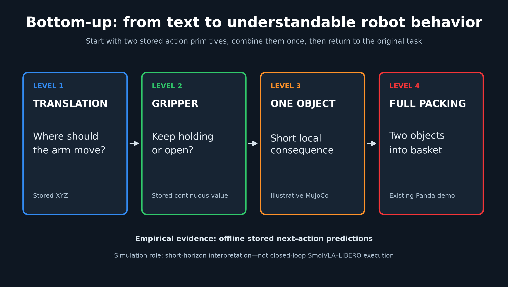

# Controlled Language Sensitivity in SmolVLA

This repository studies a simple reliability question for vision-language-action models:

> How much does SmolVLA's predicted robot action change when only the natural-language instruction changes?

We evaluate the pretrained [`HuggingFaceVLA/smolvla_libero`](https://huggingface.co/HuggingFaceVLA/smolvla_libero) checkpoint on demonstrations from [`HuggingFaceVLA/smol-libero`](https://huggingface.co/datasets/HuggingFaceVLA/smol-libero). The camera images, robot state, preprocessing, model checkpoint, and explicit flow-matching noise are held fixed within every comparison. Only the instruction changes.


**Main result:** semantically equivalent paraphrases generally produce smaller action changes than contradictory instructions, while unrelated instructions produce the largest average changes. This is an offline next-action study, not a closed-loop task-success or safety evaluation.

## Project highlights

- Real pretrained SmolVLA inference; no training or fine-tuning
- 10 robot-demonstration episodes and 200 stratified observations
- 4 controlled language conditions and 800 stored predictions
- Identical explicit flow noise within every four-condition comparison
- Episode-cluster bootstrap confidence intervals
- Independent forensic validation of the stored results
- A 31-prompt robustness extension over 20 selected observations
- An offline result viewer and presentation-ready figures, GIFs, MP4s, and MuJoCo illustrations

## Method

For each selected observation, the experiment evaluates four instructions:

| Condition | Instruction type |
|---|---|
| **Correct** | Original demonstrated task |
| **Paraphrase** | Same task expressed with different wording |
| **Contradictory** | Partially conflicts with the demonstrated task |
| **Unrelated** | Requests a different manipulation task |

The controlled comparison is:

```text
same two images + same robot state + same checkpoint + same flow noise
                                  |
                    change only the instruction
                                  |
              compare the predicted 7-D next action
```

The seven action dimensions contain XYZ translation, three axis-angle orientation components, and one continuous gripper command.

## Results

### Language-induced action change

Mean full 7-D distance from the Correct-language prediction:

| Altered condition | Mean distance | Episode-cluster bootstrap 95% CI | Arm-only 6-D mean |
|---|---:|---:|---:|
| Paraphrase | **0.2028** | [0.1725, 0.2314] | 0.1496 |
| Contradictory | **0.3543** | [0.2974, 0.4145] | 0.2103 |
| Unrelated | **0.8064** | [0.7619, 0.8560] | 0.4670 |

The aggregate ordering survives removal of the gripper channel. It is not universal: the strict Paraphrase < Contradictory < Unrelated ordering holds in 125 of 200 observations and fails in 75.

### Agreement with the recorded expert action

Mean translation / axis-angle orientation / gripper errors:

| Condition | Translation | Orientation | Gripper |
|---|---:|---:|---:|
| Correct | **0.3402** | **0.0708** | **0.2085** |
| Paraphrase | 0.3633 | 0.0716 | 0.2289 |
| Contradictory | 0.4146 | 0.0720 | 0.2763 |
| Unrelated | 0.6152 | 0.0927 | 0.6563 |

These are agreement measurements against a recorded demonstration, not objective accuracy or proof that the demonstrated action is optimal.

## Evidence gallery

### Real demonstration frames

The following GIF contains the complete stored episode-0 trajectory from the agent and eye-in-hand cameras. It uses dataset frames rather than simulation.


### Main analysis figures

| Language-induced action difference | Agreement with the recorded expert action |
|:---:|:---:|
|  |  |
| **Sensitivity across task progress** | **Gripper-command semantics** |
|  |  |

High-resolution PDF versions are available in [`results/figures/final/`](results/figures/final/).

### Bottom-up interpretation

This extension moves from stored translation proposals, to the gripper decision, to a short one-object MuJoCo illustration, and finally to the full packing visualization.




### Videos

| Deliverable | Preview or video | What it shows |
|---|---|---|
| 10-second Panda teaser | [MP4](results/mujoco_panda_prompt_demo/videos/panda_prompt_demo_teaser.mp4) · [GIF](results/mujoco_panda_prompt_demo/videos/panda_prompt_demo_teaser.gif) | Prompt-first presentation summary |
| 25-second Panda hero demo | [HQ MP4](results/mujoco_panda_prompt_demo/videos/panda_prompt_demo_main_hq.mp4) · [HQ GIF](results/mujoco_panda_prompt_demo/videos/panda_prompt_demo_main_hq.gif) | Stored action proposals on an articulated Panda |
| Separate full pick-and-place prompts | [Correct GIF](results/mujoco_panda_prompt_demo/videos/full_pick_place_correct.gif) · [Paraphrase GIF](results/mujoco_panda_prompt_demo/videos/full_pick_place_paraphrase.gif) · [Contradictory GIF](results/mujoco_panda_prompt_demo/videos/full_pick_place_contradictory.gif) · [Unrelated GIF](results/mujoco_panda_prompt_demo/videos/full_pick_place_unrelated.gif) | Four prompt-labeled 8-second illustrations from grasp through basket drop and retreat |
| Four-prompt comparison | [MP4](results/mujoco_prompt_animation/videos/prompt_comparison_main.mp4) · [GIF](results/mujoco_prompt_animation/videos/prompt_comparison_main.gif) | Synchronized Correct, Paraphrase, Contradictory, and Unrelated conditions |
| Bottom-up explanation | [MP4](results/bottom_up_demo/videos/bottom_up_teaser.mp4) · [GIF](results/bottom_up_demo/videos/bottom_up_teaser.gif) | Translation, gripper, one-object consequence, and packing context |
| One-object branches | [MP4](results/bottom_up_demo/videos/simple_one_object_branches.mp4) · [GIF](results/bottom_up_demo/videos/simple_one_object_branches.gif) | Four short branches from one shared simulated state |
| Official Panda actuator test | [MP4](results/mujoco_panda_hard_gate/panda_joint_gripper_hard_gate.mp4) · [GIF](results/mujoco_panda_hard_gate/panda_joint_gripper_hard_gate.gif) | Seven arm joints and the real Panda gripper actuators |

The MuJoCo media illustrates stored next-action differences. Predictions are not integrated into a closed-loop rollout, and simulator states are not fed back through SmolVLA.

## Requirements

The completed results, figures, and videos can be inspected without downloading the model or dataset.

For reproducible local analysis:

- Python 3.11
- [`uv`](https://docs.astral.sh/uv/) for environment creation
- Dependencies pinned in [`requirements.txt`](requirements.txt)

The stored model inference was produced on an Apple M2 Max using `mps:0`. Model-free analysis works on CPU. MuJoCo video rendering requires a working local graphics context and FFmpeg support through `imageio-ffmpeg`.

## Installation

Clone the repository and create the environment:

```bash
git clone https://github.com/Namprire/SmolVLA.git
cd SmolVLA

UV_CACHE_DIR=/private/tmp/smolvla-uv-cache \
  uv venv --python 3.11 .venv

UV_CACHE_DIR=/private/tmp/smolvla-uv-cache \
  uv pip install --python .venv/bin/python -r requirements.txt
```

## Quick start

### Inspect the completed experiment

Launch the offline viewer:

```bash
.venv/bin/python demo/demo.py
```

Use keys `1`-`4` to switch language conditions while keeping the observation fixed. Use the arrow keys to move between five curated examples, including a counterexample to the aggregate ordering.

List the examples without opening a window:

```bash
.venv/bin/python demo/demo.py --list-examples
```

Run its headless smoke test:

```bash
MPLBACKEND=Agg MPLCONFIGDIR="$PWD/.cache/matplotlib" \
  .venv/bin/python demo/demo.py --smoke-test
```

## Reproduce the analysis

These commands use the tracked predictions and perform **zero new SmolVLA inference**.

### 1. Recompute the primary metrics

```bash
MPLCONFIGDIR="$PWD/.cache/matplotlib" \
  .venv/bin/python experiments/analyze_language_results.py
```

This regenerates the paired language effects, recorded-expert agreement metrics, episode-cluster bootstrap summary, task-stage analysis, and Phase 8-9 figures from [`results/vla_predictions.csv`](results/vla_predictions.csv).

### 2. Run the independent forensic validation

```bash
.venv/bin/python experiments/final_independent_validation.py

MPLBACKEND=Agg MPLCONFIGDIR="$PWD/.cache/matplotlib" \
  .venv/bin/python experiments/final_viewer_audit.py
```

The independent validator deliberately avoids importing the project metric helpers. The current forensic verdict is documented in [`results/FINAL_AUDIT.md`](results/FINAL_AUDIT.md).

### 3. Regenerate final figures and documentation

```bash
MPLCONFIGDIR="$PWD/.cache/matplotlib" \
  .venv/bin/python experiments/finalize_results.py
```

The finalizer never loads SmolVLA. The local episode parquet files are only required when refreshing camera assets and the representative gripper figure.

### 4. Reproduce the multi-prompt robustness analysis

The tracked 620 predictions can be reanalyzed without model inference:

```bash
MPLCONFIGDIR="$PWD/.cache/matplotlib" \
  .venv/bin/python experiments/prompt_robustness.py --stage analyze --device cpu
```

Results and prompt definitions are in [`results/prompt_robustness/`](results/prompt_robustness/).

## Reproduce the visual evidence

The renderers below read stored predictions and local dataset frames. They do not load SmolVLA.

Generate the bottom-up figures and animation:

```bash
MPLCONFIGDIR="$PWD/.cache/matplotlib" \
  .venv/bin/python experiments/bottom_up_analysis.py

.venv/bin/python sim/mujoco_bottom_up_demo.py --mode render
```

Generate the presentation-quality Panda teaser or full hero demo:

```bash
.venv/bin/python sim/mujoco_panda_prompt_demo.py --mode render-teaser
.venv/bin/python sim/mujoco_panda_prompt_demo.py --mode render-hq
.venv/bin/python sim/mujoco_panda_prompt_demo.py --mode full-pick-place
```

Generate the synchronized four-prompt animation:

```bash
.venv/bin/python sim/mujoco_prompt_animation.py --mode render
```

Validate the official Menagerie Panda joints and gripper actuators:

```bash
.venv/bin/python sim/mujoco_panda_hard_gate.py
```

All generated media and validation reports are indexed in [`results/GIF_INDEX.md`](results/GIF_INDEX.md).

## Reproduce the full model inference

Fresh inference is expensive and is **not required** to verify the tracked results. The main driver is resumable, so the tracked 800-row CSV causes a normal run to validate and skip all completed predictions.

### Download the checkpoint and ten source episodes

```bash
HF_HOME="$PWD/.cache/huggingface" \
  .venv/bin/hf download HuggingFaceVLA/smolvla_libero \
  --local-dir "$PWD/.cache/huggingface/models/HuggingFaceVLA/smolvla_libero"

HF_HOME="$PWD/.cache/huggingface" \
  .venv/bin/hf download HuggingFaceVLA/smol-libero \
  --repo-type dataset \
  --revision v2.1 \
  --include "meta/*" "data/chunk-000/episode_00000?.parquet" \
  --local-dir "$PWD/.cache/huggingface/lerobot_v21/HuggingFaceVLA/smol-libero"
```

The dataset helper creates a separate local v3.0 view expected by LeRobot 0.4.4. It does not modify the downloaded v2.1 source.

### Run the staged experiment

To truly recompute the predictions, use a disposable clone and first preserve or remove its tracked `results/vla_predictions.csv`. Then run:

```bash
PYTORCH_ENABLE_MPS_FALLBACK=0 HF_HOME="$PWD/.cache/huggingface" \
  .venv/bin/python experiments/main_language_experiment.py --stage a --device mps

PYTORCH_ENABLE_MPS_FALLBACK=0 HF_HOME="$PWD/.cache/huggingface" \
  .venv/bin/python experiments/main_language_experiment.py --stage b --device mps
```

Stage A covers two episodes as a hard gate. Stage B completes all ten episodes. Rows are validated and flushed incrementally so an interrupted run can resume safely.

## Repository structure

```text
demo/
  demo.py                         offline stored-prediction viewer
experiments/
  main_language_experiment.py     controlled 800-prediction driver
  analyze_language_results.py     primary model-free metrics and figures
  final_independent_validation.py independent pandas/numpy audit
  prompt_robustness.py            31-prompt robustness experiment
  bottom_up_analysis.py           translation and gripper interpretation
reliability/
  inspect_gripper.py              expert gripper-semantics audit
sim/
  mujoco_panda_prompt_demo.py      articulated Panda hero renderer
  mujoco_prompt_animation.py      synchronized four-prompt renderer
  mujoco_bottom_up_demo.py         one-object and bottom-up renderer
  assets/mujoco_menagerie/         attributed official Panda asset snapshot
src/
  dataset.py                      dataset conversion and loading
  prediction.py                   controlled-noise SmolVLA API
  metrics.py                      validation and paired metrics
results/
  vla_predictions.csv             immutable primary prediction table
  figures/final/                  final PNG and PDF figures
  prompt_robustness/              31-prompt extension evidence
  bottom_up_demo/                 bottom-up figures, metrics, and videos
  mujoco_panda_prompt_demo/        Panda media and validation reports
  FINAL_AUDIT.md                  final forensic verdict and limitations
```

## Scientific scope and limitations

- This is offline frame-level next-action analysis, not closed-loop execution.
- Only one checkpoint, one manipulation task/domain, and ten locally available episodes were studied.
- Observations within an episode are temporally related; they are not 200 independent robot trials.
- Translation, axis-angle orientation, and gripper dimensions have different units and scales.
- The full 7-D Euclidean norm is a paired comparison measure, not a calibrated physical cost.
- The recorded expert action is a demonstration reference, not guaranteed optimal ground truth.
- Language conditions and prompt variants were manually designed.
- Gripper command sign does not by itself prove successful physical release.
- The MuJoCo demonstrations illustrate stored actions and do not measure SmolVLA task success.

For the concise scientific record, see [`results/final_findings.md`](results/final_findings.md). For exact integrity checks, hashes, counterexamples, and caveats, see [`results/FINAL_AUDIT.md`](results/FINAL_AUDIT.md).
