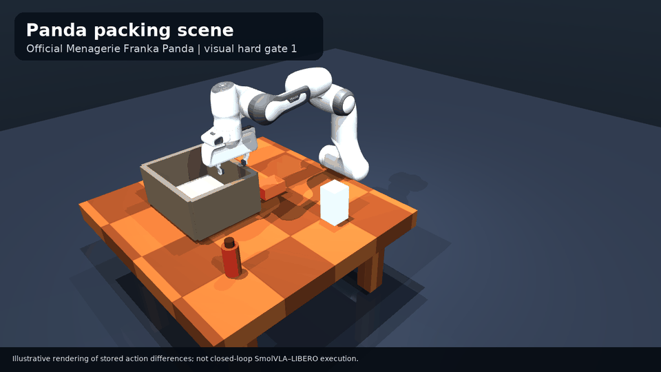
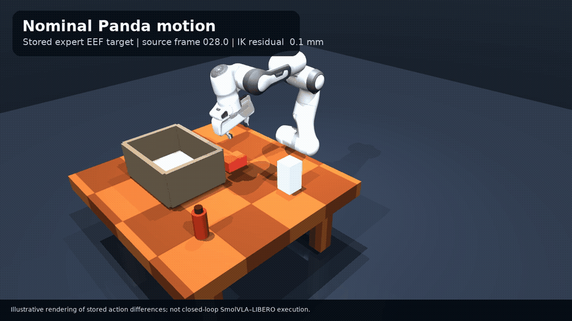
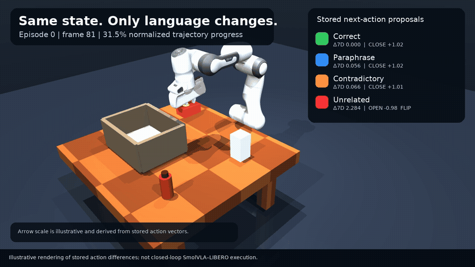
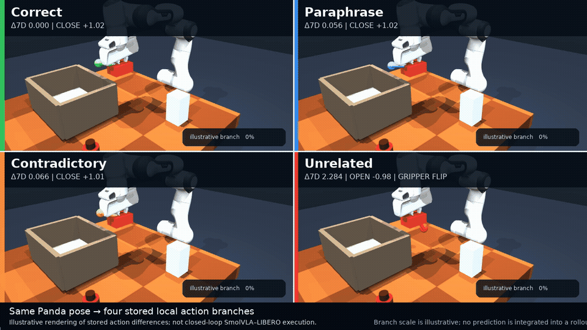

# Presentation GIF index

This is the consolidated animation set for the SmolVLA presentation.

## Recommended bottom-up explanation

`bottom_up_demo/videos/bottom_up_teaser.gif`

This 16-second sequence answers the task-level feedback directly: stored
translation proposals, stored gripper regimes across ten prompt variants, one
short one-object MuJoCo consequence, and the existing full packing case.

## Recommended short opener

### Panda prompt teaser

`mujoco_panda_prompt_demo/videos/panda_prompt_demo_teaser.gif`

This concise 10-second version combines the stable, uninterrupted wide-camera
robot motion of `hang-towel.mp4` with the prompt-first reveal and sparse action
graphics of `teaser.mp4`. It types the exact canonical instruction, accelerates
the shared stored expert-EEF target motion, then pauses at real stored frame 81
to show the four prompt-conditioned action proposals and gripper regimes.

## Recommended main GIF

### Complete Panda prompt hero demo — high quality

`mujoco_panda_prompt_demo/videos/panda_prompt_demo_main_hq.gif`

This is the primary presentation asset. It includes stored LIBERO reference
views, the reconstructed packing scene, articulated Panda nominal motion, four
stored prompt-conditioned action arrows, local branch comparisons, gripper
regimes, takeaway, and disclaimer. Its closer `hero_hq` camera, 1280 x 720
resolution, 15 fps, 256-color palette, and Sierra-2-4A dithering preserve more
of the crisp Panda detail seen in the actuator hard-gate GIF while retaining
the complete arm and task scene.

The smaller `mujoco_panda_prompt_demo/videos/panda_prompt_demo_main.gif`
(960 x 540, 12 fps) remains available as a lightweight fallback.

## New articulated Panda GIFs

### Panda packing-scene establishing shot

`mujoco_panda_prompt_demo/videos/hard_gate_1_static_scene.gif`

### Nominal Panda manipulation motion

`mujoco_panda_prompt_demo/videos/hard_gate_2_nominal_preview.gif`

### Four stored action arrows

`mujoco_panda_prompt_demo/videos/hard_gate_3_four_action_overlay.gif`

### Four synchronized local Panda branches

`mujoco_panda_prompt_demo/videos/hard_gate_4_branch_preview.gif`

## Supporting GIFs

### Original stored LIBERO two-camera reference

`demo_assets/episode_00_arm_demo.gif`

### Official Menagerie Panda actuator hard gate

`mujoco_panda_hard_gate/panda_joint_gripper_hard_gate.gif`

### Earlier simplified stored-action comparison

`mujoco_prompt_animation/videos/prompt_comparison_main.gif`

## Scientific disclaimer

> Illustrative rendering of stored action differences; not closed-loop
> SmolVLA–LIBERO execution.

The local action arrows and branch scales are illustrative. The Panda joint
motion is IK tracking of transformed stored expert end-effector targets, not a
recovered LIBERO joint trajectory.
